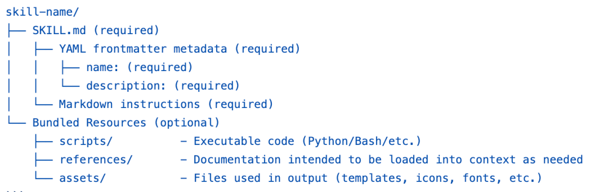
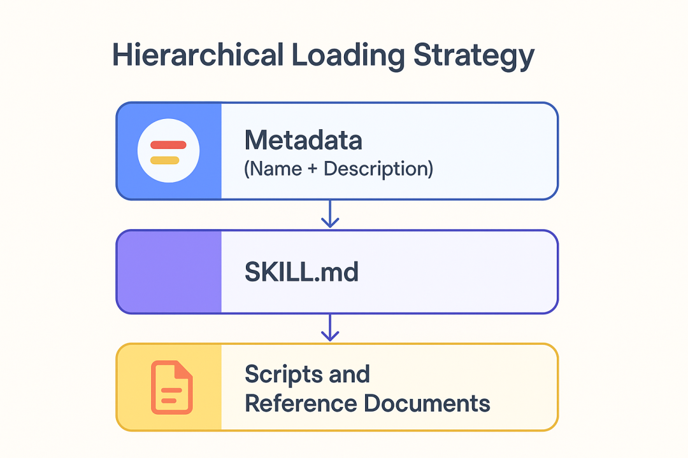
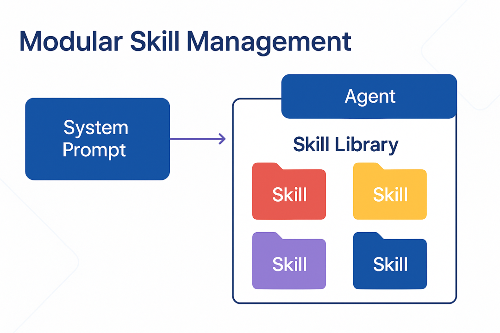

> 自己使用 Claude Code 中学习的知识分享。

## 介绍

Claude Code 是一个低层次、灵活的命令行工具，目的是帮助开发者将 Claude 模型无缝融合到编码工作中去，它更接近原始模型的能力。

## 安装

```sh
# npm
npm install -g @anthropic-ai/claude-code

# curl
curl -sL https://install.anthropic.com | sh

# update
claude update
```

## Keyboard Shortcuts

| 命令                        | 用途                           |
| --------------------------- | ------------------------------ |
| `!`                         | Bash Mode Prefix               |
| `@`                         | Mention Files/Foder            |
| `\`                         | Line Break（backslash + Entr） |
| `Esc`                       | Interrupt Claude               |
| `Ctrl+R`                    | Full output/context            |
| `Ctrl+V`                    | Paste image                    |
| `Esc+Esc`                   | 历史导航                       |
| `Shift+Tab`                 | Auto-Accept("yolo-mode")       |
| `Shift+Tab+Tab`             | Plan Mode                      |
| `Cmd+Esc / Ctrl+Esc`        | Quick Launch in IDEs           |
| `Cmd+Option+K / Alt+Ctrl+K` | Insert file references         |

## 工具

### claude-code-templates

- Github: <https://github.com/davila7/claude-code-templates>

### ccusage

功能介绍：

- Github: <>

```sh

```


### CC 启动器 Claude Code Now

- Github: <https://github.com/orange2ai/claude-code-now>

最快 CC 启动器 Claude Code Now v1.5.0 更新！

终于解决了国内用户的痛点，一键切换 API 配置。

智谱 GLM、Anthropic 官方、自定义 API 随便切换。

双击应用 → 选择服务 → 输入密钥 → 完成！

3 秒钟切换配置，不用复制粘贴，极其方便。

```sh
# Method 2
git clone https://github.com/orange2ai/claude-code-now.git
cp -r "Claude Code Now.app" /Applications/

# Method 3
# Download script
curl -fsSL https://raw.githubusercontent.com/orange2ai/claude-code-now/main/claude-code-now.sh -o claude-code-now
chmod +x claude-code-now

# Move to system path
sudo mv claude-code-now /usr/local/bin/
```

## 技巧

- macOS 复制图片是 `Control-V`

### Add Claude Code to your IDE

> https://docs.claude.com/en/docs/claude-code/ide-integrations

Claude Code 可以连接到编辑器或者 IDE，支持如下：

- **Visual Studio Code** (including popular forks like Cursor, Windsurf, and VSCodium)
- **JetBrains IDEs** (including IntelliJ, PyCharm, Android Studio, WebStorm, PhpStorm and GoLand)

> 在 Terminal 通过 `claude` 命令启动 Claude Code，然后使用 `/ide` 它会连接打开的 IDE。

Features

- **Quick launch**: Use `Cmd+Esc` (Mac) or `Ctrl+Esc` (Windows/Linux) to open Claude Code directly from your editor, or click the Claude Code button in the UI
- **Diff viewing**: Code changes can be displayed directly in the IDE diff viewer instead of the terminal. You can configure this in `/config`
- **Selection context**: The current selection/tab in the IDE is automatically shared with Claude Code
- **File reference shortcuts**: Use `Cmd+Option+K` (Mac) or `Alt+Ctrl+K` (Linux/Windows) to insert file references (e.g., @File#L1-99)
- **Diagnostic sharing**: Diagnostic errors (lint, syntax, etc.) from the IDE are automatically shared with Claude as you work.

## Skills

> 一句话说清楚：Skill 就是一个标准化的文件夹，用来打包 Agent 完成特定任务所需的知识和工具。

一个 Skill 文件夹通常包含这几部分：

- `SKILL.md` ：核心文件，**必须存在**。里面用 YAML 写元数据（名字、描述），用 Markdown 写详细的指令，告诉 Claude 在什么情况下、以及如何使用这个 Skill。
- `scripts/` ：存放可执行的 Python、Shell 脚本。比如 PDF 处理 Skill 里，就有 `fill_fillable_fields.py` 这种确定性极强的代码。
- `references/` ：存放参考文档。比如 API 文档、数据库 Schema、公司政策等，这些是给 Claude 看的知识库。
- `assets/` ：存放资源文件。比如 PPT 模板、公司 Logo、React 项目脚手架等，这些是 Claude 在执行任务时直接使用的文件，而不是阅读的。



一个 Skill = 任务说明书 SKILL.md + 工具代码 (scripts) + 专业知识 (references) +素材资源(assets)。

它把完成一个特定任务所需的一切都打包好了，本质上就是一种代码和资源的组织方式，一种约定优于配置的理念。

### 精髓：为上下文窗口减负

这部分是 ClaudeSkills 设计的精髓，也是它和简单 RAG/MCP/FunctionCalling 的最大区别。它就是一套聪明的，为了节省上下文窗口而设计的分层加载策略。

既然是分层策略，那么有哪几层？



- 第一层：元数据（Name + Description）。这部分信息非常简短，会常驻在 Claude 的脑海里。当用户提出一个任务时，Claude 会快速扫描所有可用 Skill 的描述，判断哪个可能相关。这是第一道筛选，成本极低。
- 第二层：SKILL.md。当 Claude 认为某个 Skill 相关时，它才会去加载 SKILL.md 里的详细指令。这部分内容告诉 Claude 完成任务的具体步骤、应该遵循的规则、以及如何使用文件夹里的其他资源。这步的上下文消耗中等。
- 第三层：脚本和参考文档。只有当 SKILL.md 里的指令明确要求，或者 Claude 在执行中判断需要时，它才会去读取 scripts/里的代码或 references/里的文档。这步的上下文消耗是按需的，避免了一次性把所有东西都塞进去。

这个机制的好处显而易见，极大地节省了宝贵的上下文窗口 。它先凭经验判断用哪个 SOP，然后翻开 SOP 照着做，遇到具体问题再查阅附录或工具手册。这套逻辑，我们用代码当然也能实现，但 Skills 把它标准化了。

### 和 MCP 的关系

MCP 是一种通信协议。它定义了 Agent（客户端）如何与一个暴露了工具的服务（服务端）进行标准化的交流。它解决的是 **Agent 与外部工具如何对话的问题**。

Claude Skills 是一种能力封装格式。它定义了 Agent 自身应该具备哪些知识、工作流和内部工具。它解决的是 **Agent 如何思考和行动的问题**。

Skill 里的知识可以指导 Agent 如何更有效地去使用一个遵循 MCP 协议的工具。一个 Agent 完全可以加载一个 Skill，然后根据 Skill 里的指令，去调用一个远程的 MCP 服务器。


所以你看，它俩不是替代关系，而是正交的、可以组合的。 MCP 负责连接，Skills 负责驱动。一个解决通信标准，一个解决能力封装。

### 我们开发者有什么用？

这玩意儿本质上就是一堆文件夹和代码，我们开发者能从中得到什么？

最大的价值是：Anthropic 把他们在生产环境中打磨出的一套 Agent 能力管理的设计模式开源了 。我们完全可以把这个模式借鉴过来，用在自己的 Agent 体系里，不管你用的是 Qwen、Deepseek，还是别的模型。



当你的 Agent 能力越来越多时，怎么管理？一个几千行的 System Prompt？一个包含几十个工具函数的大杂烩文件？这些都很难维护。

而 Skills 提供了一种解耦的、模块化的方案 。你团队里的 Agent 不再是依赖一个巨大的、难以维护的 system_prompt.txt，而是一个由几十个标准化的 Skill 文件夹组成的能力库，每个 Skill 都可以独立版本控制、测试和迭代。

### 举个栗子

比如你可以为你的公司创建一个数据分析工具，起名为：internal-analytics-skill，里面包含：

- SKILL.md：指导 Agent 如何查询公司内部数据仓库。
- scripts/generate_report.py：一个固定的 Python 脚本，用于生成标准格式的周报。
- references/db_schema.md：数据仓库的 Schema 文档。
- assets/report_template.docx：周报的 Word 模板。

当有新的 Agent 实例加入时，你只需要让它加载这个 Skill，它就立刻学会了如何做数据分析，而不需要重新训练或编写复杂的 Prompt。

所以说呀，Claude Skills 本身不是什么黑科技。它最大的启示还是：AI Agent 的未来，一半靠模型，另一半靠工程。

### 如何使用 Skills

使用方式对比
在不同平台的调用方式：
Claude Code/plugin marketplace
add anthropics/skills
然后直接说：
"use the pdf skill to extract form fields from file.pdf"
Claude.ai
付费用户已内置，直接在对话中调用即可
Claude API
通过 Skills API 上传和使用自定义 skills

#### Claude Code 中

### Anthropic 开源了最新发布的 Claude Skills

[开源推荐] Anthropic 开源了最新发布的 Claude Skills，有 14 个示例直接复制来用，创意设计、开发构建、文档处理和企业沟通都有。

先复习一下 Skills 的概念
Skills (技能) 包含指令、脚本和资源的文件夹，Claude 可以动态加载这些内容，以提高在专业任务上的表现。简单来说，Skills 就是教会 Claude 以可重复的方式完成特定任务的"教程包"。

开源项目目的
· 示例展示 - 展示技能系统的各种可能性
· 学习参考 - 为开发者提供创建自定义技能的灵感和模式
· 技术规范 - 提供标准的技能格式定义

Skills 分类
项目包含 14 个示例技能，分为以下几类:

1. 创意设计类
   · algorithmic-art：使用 p5.js 创建生成艺术
   · canvas-design：设计视觉艺术（PNG/PDF 格式）
   · slack-gif-creator：创建适合 Slack 的动画 GIF
2. 开发构建类
   · artifacts-builder：构建复杂的 HTML artifacts
   · mcp-server：创建 MCP 服务器集成外部 API
   · webapp-testing：使用 Playwright 测试 Web 应用
3. 企业沟通类
   · brand-guidelines：应用品牌规范
   · internal-comms：撰写内部沟通文档
   · theme-factory：为 artifacts 应用专业主题
4. 文档处理类
   · docx、pdf、pptx、xlsx：处理各类办公文档

技术架构
技能的结构非常简洁：
· 每个技能就是一个文件夹
· 必须包含一个 SKILL. md 文件
· 文件包含 YAML 前置数据（元数据）和 Markdown 内容（具体指令）

工作原理
· 用户通过自然语言提及技能名称
· Claude 在技能注册表中查找匹配
· 加载对应的 SKILL. md 文件
· 按照文件中的指令执行任务

开源地址：
https://github.com/anthropics/skills

## MCP

### Chrome MCP

```sh
# install
```